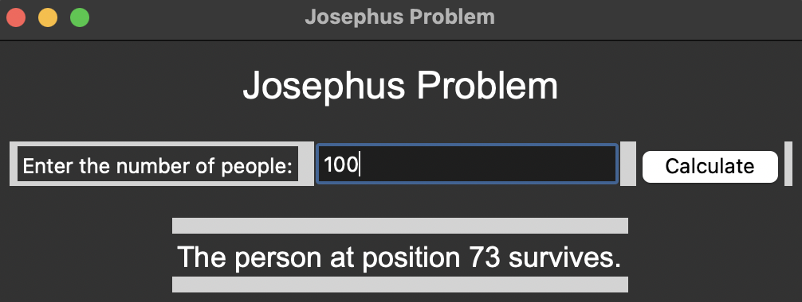

# Josephus Problem Solver
A GUI application to solve the Josephus problem, a classic mathematical puzzle.
## What is the Josephus problem?
The Josephus problem is a well-known mathematical puzzle that involves finding the position of a person in a circle who will survive a series of eliminations.
## Requirements
- Python 3.x
- Tkinter library (built-in with Python)
## How to use
- Clone the repository
- Run python main.py to start the application
- Enter the number of people in the circle
- Click the "Calculate" button to find the position of the survivor
## Image

